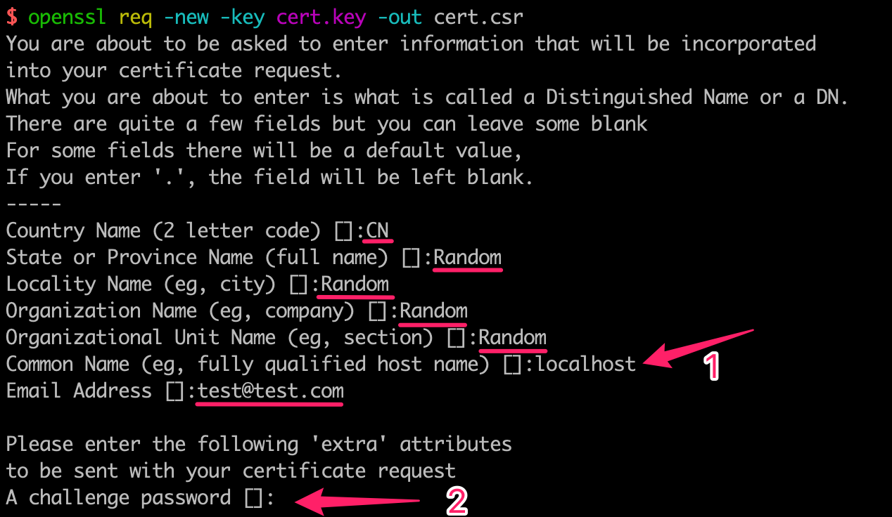
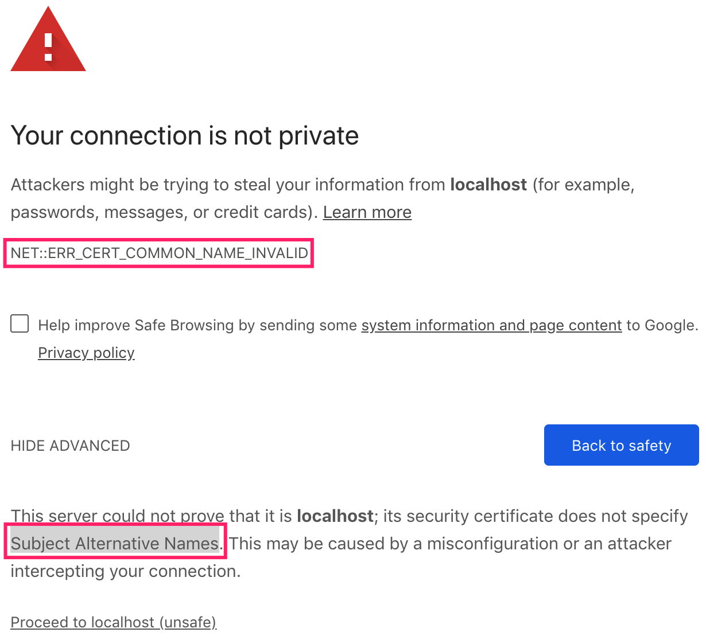
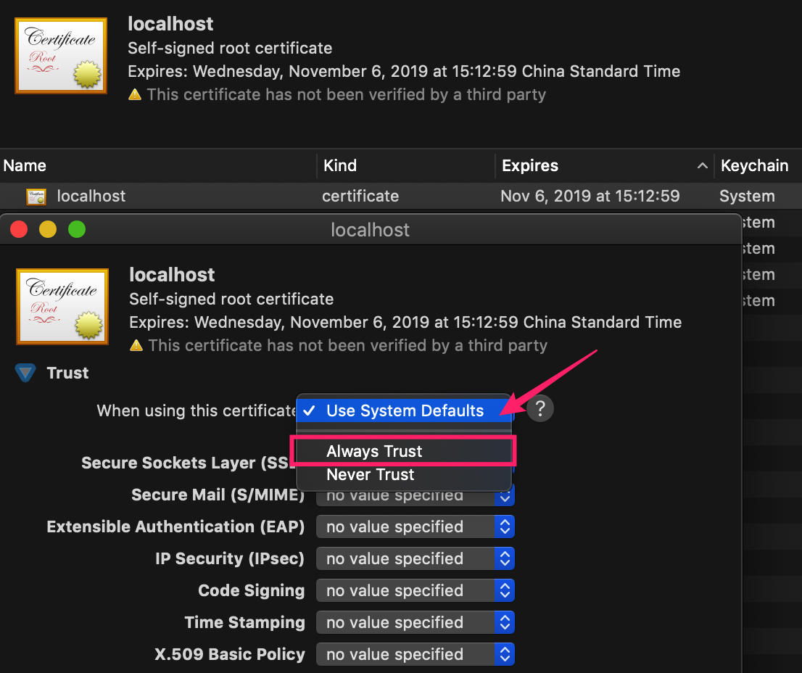
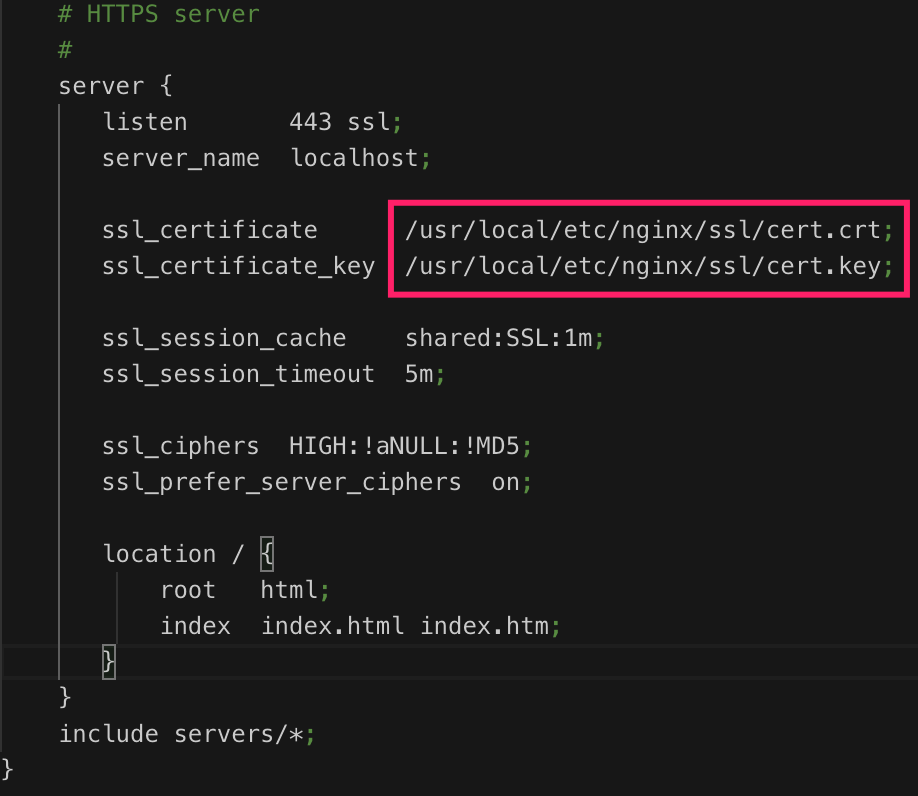

# 生成自签名证书

*2018-11-06*

自签名证书可以在本地、CI环境使用https协议以及http2协议。本文主要梳理下生成自签名证书的流程和命令，同时介绍nodejs和Nginx的配置。

## 一、生成自签名证书

生成证书，主要用到 ```openssl``` 命令。具体步骤如下：

1. 生成私钥

```bash
openssl genrsa -out cert.key
```

生成RSA私钥文件 ```cert.key```，默认秘钥长度是2048位。

2. 生成证书请求文件

```bash
openssl req -new -key cert.key -out cert.csr
```

根据私钥文件生成证书请求文件 ```cert.csr```。这个过程需要录入以下信息，可以随便填写。



需要特别注意注意两处：

* **「重点」**```Common Name(eg, ...) []: ```，这里需要输入站点的 host name。这里是本地环境输入 localhost。

* ```A challenge password []```，这里我们不需要输入密码，直接点击 Enter 键完成。


3. 生成自签名证书

```bash
openssl x509 -req -days 365 -in cert.csr -signkey cert.key -out cert.crt
```

生成x509证书文件 ```cert.crt```，有效为365天。然而，如果使用这个证书文件 ```cert.crt```，最新的Chrome浏览器会告警站点不安全。



证书文件里还需要添加 ```Subject Alternative Names``` 信息。

4. 添加 subjectAltName 信息

```bash
openssl x509 -req -extfile <(printf "subjectAltName=DNS:localhost") -days 365 -in cert.csr -CA cert.crt -CAkey cert.key -CAcreateserial -out cert.crt 
```

重新签名，添加 subjectAltName 信息，覆盖源文件 ```cert.crt```。

5. 添加证书到系统 （MacOS）

使用系统应用 ```keychain Access``` 导入 ```cert.crt```文件，将该证书设置为授信证书。如下图，



以上步骤会生成：cert.crt, cert.csr, cert.key, cert.srl 四个文件。接下来主要会用到 .crt 和 .key 文件。

## 二、Nginx 启用https

复制 cert.crt 和 cert.key 文件到任意目录 ```/usr/local/etc/nginx/ssl/```。在 Nginx 配置文件 ```nginx.conf```里，设置 ```ssl_certificate``` 和 ```ssl_certificate_key``` 两个值，启动 nginx，访问 [https://localhost/](https://localhost/) 便能看到 nginx 的欢迎页面。




## 三、Node.js启用https

创建 ```https-server.js```文件

```javascript
const https = require('https');
const fs = require('fs');

const ssl_option = { 
  key: fs.readFileSync('cert.key'), 
  cert: fs.readFileSync('cert.crt') 
};

const server = https.Server(ssl_option, (req, res) => {
  res.writeHead(200, { "Content-Type": "text/plain" });
  res.end("hello world");
});

server.listen({port: 443}, () => console.log("https://localhost/"));
```

将生成的 ```cert.key``` 和 ```cert.crt```放到同级目录下，使用 ```sudo node https-server.js``` 命令启动服务。访问 [https://localhost/](https://localhost/) 便能看到 hello world 信息。

## 四、自定义域名

以上都在本地环境访问 https://localhost/ 地址看到结果。如果访问自定义域名，需要修改系统hosts文件，同时在生成证书文件时填入相应的host name。


例如，最终访问自定义域名 ```https://dev.local.me/``` 。

1. 修改hosts文件

在 ```/etc/hots``` 文件追加一行

```bash
127.0.0.1	dev.local.me
```

2. 修改 Common Name 和 Subject Alternative Names 值

在第二步「生成证书请求文件」，录入 ```Common Name(eg, ...) []:``` 信息为 ```dev.local.me```。

在第四步「重新签名，添加 subjectAltName 信息」的命令信息 ```"subjectAltName=DNS:localhost"``` 改为 ```"subjectAltName=DNS:dev.local.me"```

生成证书文件的其余步骤保持不变。


对与Nginx，需要修改nginx.conf文件的 server_name 为```dev.local.me```。

对于Node.js，需要修改设置 host 属性值

```javascript
server.listen({
  port: 443,
  host: 'dev.local.me'
}, () => console.log("https://dev.local.me"));
```

### 参考

* [笔记：OpenSSL 生成「自签名」证书遇到的 missing_subjectAltName 问题](https://moxo.io/blog/2017/08/01/problem-missing-subjectaltname-while-makeing-self-signed-cert/#node-js-启用-https-服务的代码片段)
* [Chrome had deprecated support for commonName matching in certificates](https://groups.google.com/a/chromium.org/forum/m/#!topic/security-dev/IGT2fLJrAeo)
* [How to get HTTPS working on your local development environment in 5 minutes](https://medium.freecodecamp.org/how-to-get-https-working-on-your-local-development-environment-in-5-minutes-7af615770eec)
* https://github.com/dakshshah96/local-cert-generator
* [给Nginx配置一个自签名的SSL证书](https://www.liaoxuefeng.com/article/0014189023237367e8d42829de24b6eaf893ca47df4fb5e000)