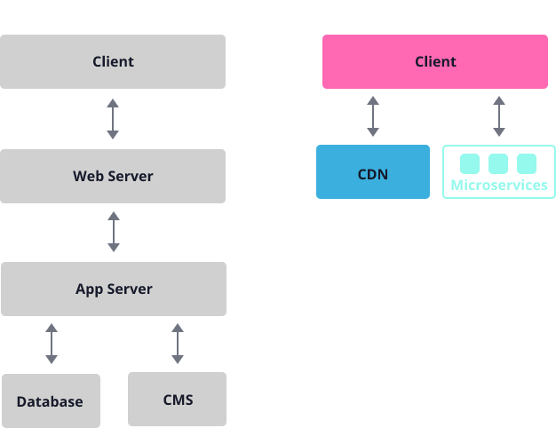

# 大型网站JAMStack架构实践

发布于: 2022.01.09

## 前言

2021年中，在一个全球官网重建项目上工作。项目期望替换老旧的CMS系统，有更好的访问速度和自然搜索排名，涉及十多个地区及语言。最终我们采用JAMStack架构来实现。

本文主要分享一下使用JAMStack架构构建大型网站的实践经验。

## 一、为什么选择JAMStack

以WordPress为代表的传统CMS是很优秀的产品，但它们无法提供更好的访问速度和安全性。

2019年底，技术雷达上提到了[JAMStack](https://www.thoughtworks.com/radar/techniques/jamstack)架构，主要技术包括：静态站点生成器(Static Site Generator)，无头CMS(Headless CMS) 和 CDN。使用静态站点生成器与无头CMS API集成生成静态页面，然后部署到CDN，能够给网站带来更好的性能、安全性和扩展性。

<!-- markdownlint-disable no-inline-html -->
<figure>
  
  <figcaption>传统CMS架构与JAMStack架构对比，来自 https://jamstack.org/</figcaption>
</figure>
<!-- markdownlint-enable no-inline-html -->

实际上2010年前就存在这种架构方案。只因为静态站点生成器使用Java、Ruby等语言，与前端代码集成构建难度较大，导致开发成本较高。自从Node.js诞生后，前端框架和构建工具的兴起，静态站点生成器生也可以使用JavaScript语言，并且能够和React、Vue前端框架融为一体，极大的降低了开发成本。

## 二、JAMStack技术选型

在使用JAMStack架构时，优先选择Headless CMS产品，其次才是云服务和静态站点生成器。当前大多数Headless CMS都是付费的，且不同的价格提供了不同的功能。也有一些免费开源的Headless CMS产品，仅提供了基础功能，更多功能需要二次开发。因此选择一款适合运维团队的CMS产品，能够节省很多开发成本和后期的维护成本。

### 选择适合运维团队的 Headless CMS 产品

你需要根据运维团队规模、编辑权限、发布流程、操作习惯、维护内容易用性等方面，去对比CMS产品功能是否满足。以下是实践中三种角色较为重要的功能需求。

1. 内容编辑角色（Editor）
    * **内容预览**。编辑者期望看到发布后的预期效果，这是非常重要的功能。Headless CMS需要结合静态站点生成器一起实现，需要调研CMS产品是如何提供预览操作。
    * **富文本编辑器**。大多数编辑者更喜欢使用WYSIWYG编辑器，而不是Markdown编辑器。需要调研CMS如何如何替换。
    * **多媒体资源管理**。图片和视频这些多媒体资源会越来越多，编辑者需要按照类型、标签、时间、关键词等方式快速查找。
    * **内容历史版本化**。编辑者需要对比历史版本内容，了解差异；也需要快速回退到前一个版本，重新发布。需要调研CMS有没有这个功能，以及二次开发成本如何。
    * **国际化(i18n)**。全球化网站必要的功能。特别需要调研CMS是否支持阿拉伯语、希伯来语用户的使用习惯。
    * 还有 **批量编辑**、**内容翻译** 等辅助功能。
2. 管理员角色（Admin）
    * **角色权限管理**。大型网站都会划分内容板块，由不同的内容编辑团队独立维护。管理员需要为这些团队设置不同的权限。一些CMS产品会使用不同的价格来限制角色个数。
    * **操作日志**。管理员或其他角色需要查看关键事件发生了什么操作，便于问题回溯。
3. 开发者角色（Developer）
    * **独立部署**。需要调研CMS是否支持独立部署，这涉及到数据存储安全等问题。
    * **集成登录认证系统**。需要调研好CMS如何集成已有的认证系统。
    * **集成内容发布流程**。一些大型维护团队会有严格的发布审批流程，你需要调研CMS如何集成当前的审批流程系统。
    * 还有 **Webhook**，**REST 和 GraphQL API**，**插件扩展** 等功能，都是Headless CMS产品必备功能。

### 选择合适的云服务

云服务环境搭建对于JAMstack架构是至关重要的。特别是大型全球网站，你不仅需要考虑到云服务商的CDN节点分布、带宽等性能问题；还需要考虑到欧盟的GDPR法案对于数据存储、数据同步，以及部署架构的影响。

搭建大型的JAMstack应用的CI和部署环境，有以下两种方案供你参考：

* **使用AWS或阿里云等基础设施自行搭建**。这些云服务都比较成熟，你需要有经验的DevOps角色帮助团队搭建所有环境。其中CDN服务的流量费用，你也需要做好预先评估。
* **使用网站托管平台**，如 [Vercel](https://vercel.com/)。这类平台是进几年兴起的，它能够与JAMstack网站工作流程的无缝衔接，提供开发、预览、发布的集成环境，还提供CDN服务的支持，简化很多基础设施的工作。但对于大型全球网站部署的需求，你需要单独联系他们的客服。

### 选择静态站点生成器框架

在JAMstack官网列举了很多[静态站点生成器](https://jamstack.org/generators/)，覆盖了主流的前端三大框架（React, Vue, Angular）。

这些静态站点生成器，本质上是将前端框架和对应的Server-Side Rendering框架重新整合而成，分别构建出client和server两端的代码，作用于不同的运行环境。基于React的 Next和Gatsby，和基于Vue 的 Nuxt 都是很优秀的静态站点生成器，他们的生态已经很成熟，你可以放心的选择他们。

## 三、JAMStack开发实践

由于JAMStack架构采用前后端代码解耦，静态站点生成器框架在实践过程中使用多种模式，相对于传统的CMS单体应用来说，具有一定的复杂度。以下总结了使用NuxtJS和Strapi CMS实施JAMStack架构应用的一些实践经验。

* **预览模式**。Headless CMS需要和静态站点生成器一起实现。我们使用NuxtJS的[server模式](https://nuxtjs.org/docs/configuration-glossary/configuration-target)，作为一个node应用服务单独部署；配置Strapi的预览URL参数，在Strapi页面增加预览按钮，这样内容编辑者便可以实时预览到期望的页面效果。如果Headless CMS 是SaaS服务，你需要着重研究怎么搭建预览环境。
* **区分静态站点生成器Server端与Client端上下文**。NuxtJS的一些代码会在server端node.js中里运行，也会在client端浏览器中运行。你需要清晰的区分这两种运行时上下文环境，将有助于你解决问题。其他静态站点生成器也是如此。
* **静态页面与动态页面**。不是所有页面都应该生成静态页面，例如带有分页和查询条件的列表页面，无法穷举所有条件生成静态页面，应当使用前端动态渲染，并将分页参数等作为查询字符串持久化到URL上。有时要考虑到内容的实时性，也需要由前端实时获取数据动态渲染。
* **重定向404页面**。在生成静态页面过程中，页面的主要数据CMS返回为空时，我们会将它重定向到404页面，避免访问到一个空白页面。
* **CMS国际化与前端国际化**。应当根据页面内容更新频率和内容编辑者关注点来区分。比如表单页面及其提示其错误信息时，更推荐使用前端框架国际化来处理。
* **显示富文本内容**。前端渲染富文本内容时，需要与富文本编辑器内所呈现的效果保持一致。应当由编辑者使用编辑器功能，自己控制段落间距、对齐方式等。减少前端过度的自定义样式。
* **响应式图片**。Strapi会将上传的图片压缩成不同尺寸的小图，推荐前端使用`<picture>`标签，在不同尺寸设备上显示不同图片。
* **视频封面**。在CMS端设计字段时，一定要为视频多增加一个视频封面字段。因为受到iOS端Safari的限制，是无法使用视频第一帧作为视频封面。
* **加速静态页面生成**。在生成静态页面时，会并行发送大量API请求到Headless CMS获取数据，有可能会出现请求超时的问题。你需要关注服务器和数据库的负载情况，横向扩展CMS实例或DB实例，尽可能减小静态页面的总时长。
* **GeoIP与Accept Language**重定向。一般访问多语言的Web应用根路径，都会根据用户的地理IP或浏览器第一语言，重定向到对应国家/地区站点首页。你需要根据网站的特征灵活使用。比如，电商网站，各国家/地区页面信息不同，使用GeoIP重定向会更友好。
* **多语言页面设计**。请检查你的设计，一定要预留足够的空间区域呈现文字，特别是mobile端。因为有些语言的单词会比中文长很多，你也无法强行限制他们的语言习惯。
* **SEO**。JAMStack架构的优点之一就是对SEO友好。你储备一定的SEO知识，不仅需要合理使用 html 标签，和生成 robots.txt, sitemap.xml 文件，还有涉及到如何管理多语言网站和重复网址，这些都会影响到搜索引擎的抓取和索引。甚至要为部分页面定制 [结构化数据](https://developers.google.com/search/docs/advanced/structured-data/intro-structured-data?hl=zh-cn)，来控制搜索结果显示。
* **GDPR**。你需要设计欧盟地区站点怎么与GDPR法案结合。比如，提示用户是否使用Google Analytics采集行为数据，以及独立存储欧盟地区用户数据等。
* **社交媒体分享**。使用[Open Graph](https://ogp.me/)协议可以很友好的分享一个页面信息给你的好友。但你还需要单独研究微信小程序和twitter特殊的处理方式。

## 四、思考JAMStack架构

当然JAMStack架构也带来一些新的问题：

* **糟糕的内容管理体验**。Headless CMS无法可视化填写内容，需要撰写大量的使用文档，告诉运营人员什么字段会在页面什么位置显示，这对运营人员非常不友好。
* **低效的构建过程**。大型网站生成静态页面，会是一个漫长的等待过程。

JAMStack 架构是一个优秀的CMS系统解决方案，解耦能带来一定的好处。但JAMStack不是银弹，不会完全代替传统的CMS，选择适合你的业务和团队诉求即可。

## 参考资料

* [Modern Web Development on the JAMstack](https://www.netlify.com/pdf/oreilly-modern-web-development-on-the-jamstack.pdf)，O’Reilly
* [JAMStack.org](https://jamstack.org/)
* 技术雷达：[JAMStack](https://www.thoughtworks.com/zh-cn/radar/techniques/jamstack)，[Vercel](https://www.thoughtworks.com/zh-cn/radar/platforms/vercel)
* [Google SEO 高级 SEO操作指南](https://developers.google.com/search/docs/advanced/guidelines/get-started?hl=zh-cn)
* [Cookie的分类与Cookie同意](https://www.janusec.com/articles/privacy/1580821969.html)
* [Open Graph protocol](https://ogp.me/)
* [Schema.org](https://schema.org/)
* [The Rising Complexity of JAMstack Sites and How to Manage Them](https://css-tricks.com/the-rising-complexity-of-jamstack-sites-and-how-to-manage-them/)
