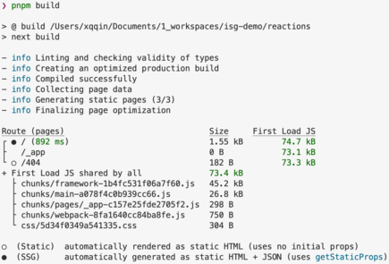
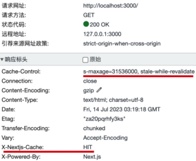
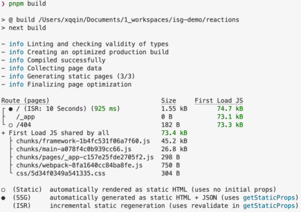
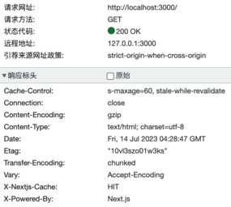
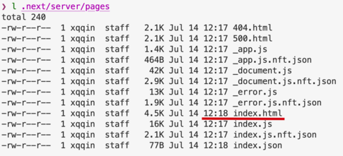
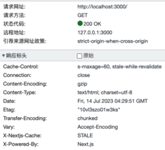

# 增量静态生成（ISR）调研

发布于: 2023.07.14

## 概要

本文主要调研Jamstack架构下增量静态生成(ISR)技术方案的实现过程和缺陷，以及主流框架的实现情况。

## 背景

自2016年开始出现的[Jamstack](https://jamstack.org/)架构，为电子商务、营销、博客等以内容为主的应用网站提供了一个崭新的技术架构，继续在探索同时满足SEO要求和页面访问性能的解决方案。

笔者在2021年中参与的一个官网重建项目，实践了JAMStack架构（没错，那时候是大写的JAMStack），使用全量服务端静态生成（Server Side Generater, SSG）和原子部（Atomic Deploy）方案。

不过随着时间的推移，Jamstack架构面临着两大痛点，

- **低效的构建过程**。大型网站生成静态页面，构建时长已经无法忍受。
- **糟糕的内容管理体验**。Headless CMS无法可视化填写内容，体验非常不友好。

2021年底项目交付时，全量生成静态页面一次耗时20分钟。一年半过去后，全量生成耗时近1个小时。运营人员很难忍受这漫长的等待的时间，也可以预想到未来的等待时间会更久。

可以想到的是在过去的一年半里，页面数量增加最多的是“新闻”类页面，12种语言几乎每天都有发布当地语言的文章，每次内容的变动都会全量的重新生成静态页面和部署。那么，是否可以实现增量生成，不再重新生成老页面？

## 增量静态生成ISR

在patterns.dev的[Incremental Static Generation](https://www.patterns.dev/posts/incremental-static-rendering)介绍到

> The Incremental Static Generation (iSSG) pattern was introduced as an upgrade to SSG, to help solve the dynamic data problem and help static sites scale for large amounts of frequently changing data. 增量静态生成 (iSSG) 模式是作为 SSG 的升级而引入的，旨在帮助解决动态数据问题并帮助静态站点针对大量频繁变化的数据进行扩展。

在Next.js文档里称其为[Incremental Static Regeneration](https://nextjs.org/docs/pages/building-your-application/data-fetching/incremental-static-regeneration) (ISR)。这里以Next.js官[GitHub Reactions Demo](https://github.com/vercel/reactions/tree/master)分析ISR机制。

### Next.js 的ISR初步研究

注释掉 `pages/index.js`第58行值，然后本地运行应用。

```JavaScript
  return {
    props: {
      reactions,
    },
    // revalidate: 1
  };
```

根路径页面使用SSG方式生成。访问页面返回响应头信息 `Cache-Control: s-maxage=31536000, stale-while-revalidate` 和`X-Nextjs-Cache: HIT` 。

 

修改`revalidate` 值为60，重新构建，根路径页面同样是SSG方式生成，同时ISR的重新验证间隔时间是60秒。在启动服务后的60秒内，访问页面都会返回响应头信息 `Cache-Control: s-maxage=60, stale-while-revalidate` 和 `X-Nextjs-Cache: HIT`；关闭打开浏览器从新访问得到同样信息。

 

超过60s后重新访问页面，可以看到响应头返回`X-Nextjs-Cache: STALE`，说明当前页面已过期，正在重新生成新页面。

 

以上过程在[https://reactions-demo.vercel.app/](https://reactions-demo.vercel.app/) 介绍了工作流程，这里引用文章《[使用Next.js进行增量静态再生（ISR）的完整指南](https://juejin.cn/post/6977783923099041800)》的配图。


### ISR存在缺陷

对于已经被预渲染的页面，用户直接从 CDN 加载，但这些页面可能是已经过期的，甚至过期很久的，只有在用户刷新一次，第二次访问之后，才能看到新的数据。这对于一些时效性较高的场景来说，是不合适的。这就需要按照不同维度划分网站页面，恰当的使用ISR方案。

详见Netlify的文章《[Incremental Static Regeneration: Its Benefits and Its Flaws](https://www.netlify.com/blog/2021/03/08/incremental-static-regeneration-its-benefits-and-its-flaws/)》

### 实现ISR的框架

当前较为主流的框架实现ISR的情况，

Next.js，2020年8月，v9.5.0版本增加的[Incremental Static Regeneration](https://nextjs.org/docs/pages/building-your-application/data-fetching/incremental-static-regeneration)新特性。

Gatsby，2021年10月，v4.0版本增加的 [Deferred Static Generation](https://www.gatsbyjs.com/docs/how-to/rendering-options/using-deferred-static-generation/) (DSG)新特性，和Next的ISR一样，文档比较详细。

Nuxt.js，2023年1月，v3-rc版本增加的[Hybrid Rendering](https://nuxt.com/docs/guide/concepts/rendering#hybrid-rendering)新特性，使用Nitro的cacheing-layer实现的ISR功能，见[github提问](https://github.com/nuxt/nuxt/issues/7813https://github.com/nuxt/nuxt/issues/7813)。不过到现在还处于实验性阶段，文档和参考Demo暂时不够清晰。

## 分布式的持续渲染DPR

为了解决 ISR 的一些问题，2021年4月，在jamstack.org里发起了一个新的提案：[Distributed Persistent Rendering (DPR)](https://github.com/jamstack/jamstack.org/discussions/549)。本质上讲，是对 ISR 的模型做了几处改动，并且搭配上 CDN 的能力。当然也有一定的缺陷，这里不再赘述。

以上是笔者调研的ISR方案的信息汇总，希望帮助到大家解决Jamstack架构的问题。

## 参考资料

- 掘金 - [使用Next.js进行增量静态再生（ISR）的完整指南](https://juejin.cn/post/6977783923099041800)
- 知乎 - [新一代Web建站技术栈的演进：SSR、SSG、ISR、DPR都在做什么？](https://zhuanlan.zhihu.com/p/365113639?spm=a2c6h.12873639.article-detail.7.674d2388UaiPbu)
- Github - [jamstack.org](http://jamstack.org) - discussions - [Distributed Persistent Rendering (DPR)](https://github.com/jamstack/jamstack.org/discussions/549)
- [dev.to](http://dev.to) - [How to use Distributed Persistent Rendering in Nextjs with Netlify](https://dev.to/netlify/how-to-use-distributed-persistent-rendering-in-next-js-with-netlify-4fhf)