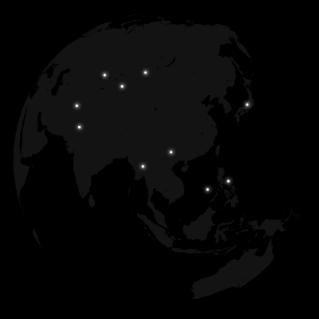
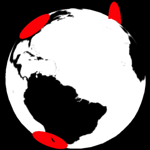
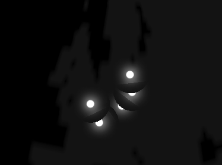

# 如何绘制一个3D地球

发布于: 2023.12.15

## 简介

最近在一个官网项目上，需要展示一个3D效果的地球，并用亮点呈现该企业在全球的分布情况。本文主要记录了，使用 `Three.js` 绘制3D地球的“流水账”过程。

<!-- markdownlint-disable-next-line no-alt-text
期望效果如下,
 -->

## 一、开始调研

### 1.1 使用什么JS库实现？

经过一些搜索，绘制3D地球的基础库有: `Echarts`, `Three.js`, `CesiumJS`。
还有两个组件库 [`globe.gl`](https://globe.gl/) 和 [`three-globe`](https://github.com/vasturiano/three-globe) 是基于`Three.js/WebGL`的实现。

* `Echarts` 有一些3D地球示例，其中 [Hello World](https://echarts.apache.org/examples/zh/editor.html?c=globe-echarts-gl-hello-world&gl=1) 示例，代码实现比较简单和期望效果比较接近，但是没有示例绘制地球上的亮点，也看不懂API。待定吧。
* `three-globe` 的 [Basic](https://vasturiano.github.io/three-globe/example/basic/) 示例比较接近设计稿，但也看不懂API，也待定吧。
* `globe.gl` 的 [World Cities](https://globe.gl/example/world-cities/) 示例也比较接近设计稿。使用 `geojson` 数据画的陆地，这数据和国家地理信息有关，需要谨慎使用（果然是有问题的）。同类的格式还有 `TopoJSON`。这种 `geojson` 数据文件不好找。放弃了。
* `CesiumJS` 的 [`Quickstart`](https://cesium.com/learn/cesiumjs-learn/cesiumjs-quickstart/)，怎么还要注册和创建 `access_token`，这么麻烦。放弃了。

只需要画个地球，没有其他复杂的动效，`three-globe` 就没必要了，还是研究一下基础库 `Three.js`。于是最简版的 TODO LIST 就有了：

* 显示3D地球
* 3D地球自动旋转
* 显示城市亮点

### 1.2 怎么绘制地球上的陆地？

再看看 `Echarts` 的 [Hello World](https://echarts.apache.org/examples/zh/editor.html?c=globe-echarts-gl-hello-world&gl=1) 示例吧。地球表面居然是一个矩形图片？它是怎么变成球面的？

<!-- markdownlint-disable no-inline-html -->
<figure style="text-align:center;">
  
  <figcaption>地球纹理图片, 来自 <a href="https://echarts.apache.org">Echarts</a></figcaption>
</figure>
<!-- markdownlint-enable no-inline-html -->

设计稿上的地球是黑白两种颜色，还得需要设计师PS图。要不先看看 `GeoJSON` 吧，可以自定义颜色。

#### 1.2.1 用 GeoJSON 数据？

`TopoJSON` 的 [world-atlas](https://github.com/topojson/world-atlas#file-reference) 这个库有比较全的地理数据。搜搜我们的台湾在哪儿，果然有妖。国内的 `GeoJSON` 数据也不好找。只需要显示陆地，不需要国家的信息。先放弃了。

#### 1.2.2 还是用地球图片？

在 YouTube 上搜搜 `three.js+globe` 的视频。啊哈，原来这类图片叫“纹理`Texture`”。在[planetpixelemporium.com](https://planetpixelemporium.com/earth8081.html) 里，有很多清晰的地球纹理图片。

<!-- markdownlint-disable no-inline-html -->
<figure style="text-align:center;">
  
  <figcaption>来自 <a href="https://planetpixelemporium.com">planetpixelemporium.com</a></figcaption>
</figure>
<!-- markdownlint-enable no-inline-html -->

并且，`three-globe` 的 [basic](https://vasturiano.github.io/three-globe/example/basic/) 示例里，也使用的是地球图片。这下可以确定使用 `Tree.js`+`Texture`纹理图片的方案，绘制3D地球。

## 二、开始画地球

### 2.1 理解 `Three.js` 对象模型

先抄个 `Three.js` 的入门教程 [Creating a scene
](https://threejs.org/docs/index.html#manual/en/introduction/Creating-a-scene)。太简单了，但 `PerspectiveCamera`, `BoxGeometry`, `MeshBasicMaterial`, `Mesh` 这些API名词怎么理解和使用？

首先，需要理解一个基础概念 [`视锥体(Viewing Frustum)`](https://cloud.tencent.com/developer/article/1802253)，你确定这是“初等”几何？看这个图帮助理解 `PerspectiveCamera` 对象模型概念，

<!-- markdownlint-disable no-inline-html -->
<figure style="text-align:center;">
  
  <figcaption>视锥体透视图, 来自 <a href="https://zhuanlan.zhihu.com/p/510877492">知乎 - HyG cs</a></figcaption>
</figure>
<!-- markdownlint-enable no-inline-html -->

再找找其他视频和Blog：

* B站视频 - [Three.js教程](https://www.bilibili.com/video/BV14r4y1G7h4/?share_source=copy_web&vd_source=87fd4ba12cc3bed7aed51c523b6749af) ，以及他的网站 [Three.js中文网](http://www.webgl3d.cn/)
* 掘金专栏 - [Three.js 进阶之旅](https://github.com/dragonir/threejs-odessey)

这下理解了，原来在 `Three.js` 里，

* 显示任何物体都是用 `Scene`，`Camera` 和 `Renderer` 这三个对象构建三维空间
* 三维物体又是通过 网格模型(`Mesh`)、几何体(`Geometry`)形状和材质(`Material`) ，三个对象组合而成的。

### 2.2 完成第一版3D地球

画一个3D地球，需要使用 球形几何体 `SphereGeometry` 对象，加载地球纹理图片和设置 `MeshBasicMaterial` 的 `map` 属性。修改一下代码，再调整颜色和旋转等参数。搞定，见 [globe-01](./12/globe-01.html) 。

一下子就完成了2个Task，还剩最后一个Task：“用亮点显示城市位置”，估计再有一天就能做完。

问题来了，`globe.rotation.y -= 0.005` 的意思是地球沿Y轴方向旋转，那么地球的旋转速度是多少呢？XYZ坐标轴分别指向哪个方向？

## 三、最后一步画城市亮点

### 3.1 地理经纬度转换三维坐标

在 [latlong.net](https://www.latlong.net/) 网站可以搜到城市的经纬度数据。接下来，怎么将经纬度值转换成球面上的一个点坐标呢？

看这篇Blog“[Three.js 地理坐标和三维空间坐标的转换](https://github.com/verymuch/blog/issues/12)”，理解了：“经纬度与地理坐标关系”，“球面坐标参数” 和 “地理坐标转换” 等理论知识。
<!-- markdownlint-disable no-inline-html -->
<figure style="text-align:center;">
  
  <figcaption>球面坐标参数, 来自 <a href="https://github.com/xswei">GitHub - xswei</a></figcaption>
</figure>
<!-- markdownlint-enable no-inline-html -->

最终，地理经纬度坐标转换三维坐标的算法，如下：

```javascript
function lglt2xyz(lng, lat, radius) {
  const phi = (180 + lng) * (Math.PI / 180)
  const theta = (90 - lat) * (Math.PI / 180)
  return {
    x: -radius * Math.sin(theta) * Math.cos(phi),
    y: radius * Math.cos(theta),
    z: radius * Math.sin(theta) * Math.sin(phi),
  }
}
```

已经忘了 `sin`，`cos`，`Math.PI/180`，“弧度”和“角度”这些三角函数的知识，赶紧恶补一下。

### 3.2 画城市亮点与地球同步旋转

效果图上的城市亮点是一个带有光晕的圆形。
先简单使用 圆形几何体`CircleGeometry` 画出来，再解决光晕效果。很快解决完以下问题：

* 城市的亮点没有和地球一起旋转
  * 解决：把 地球`Mesh`对象和城市`Mesh`集合，也`Group`起来，一起旋转。
* 需要手动旋转地球
  * 解决：添加 `OrbitControls` 对象

困难的问题来了，需要圆形亮点要贴在地球上显示，也就是：

* 圆形平面改为圆形曲面
  * 方案：搜了一下 `Three.js` 的 example，`ParametricGeometry` 这个差不多可以用。然而第一个回调方法参数 `u` 和 `v` 是什么东西？怎么算？劝退了。
* 圆形亮点和地球表面相切
  * 方案：设置亮点的 `rotation` 参数就行，简单。

依次调试处理：

1. 先显示4个点，设置纬度在赤道上，经度分别间隔90度角。得出在Y轴上的旋转弧度公式
2. 反过来，4个点都设置在同一个经度上，维度分别间隔30度角。得出在X轴上的旋转弧度公式
3. 显示所有城市，依次设置 `rotation.x` 和 `rotation.y` 弧度值。

看下最终结果。圆形平面亮点为什么没有和球面相切？

<!-- markdownlint-disable-next-line no-alt-text -->


看到文档有其他旋转接口 `setRotationFromEuler(euler: Euler)`。`Euler`这不就是“数学之神”欧拉么。还有，`setRotationFromQuaternion(q: Quaternion)`，四元数（Quaternion）又是什么？

赶紧恶补[欧拉角](https://www.youtube.com/watch?v=qqlLshaHqeE)和[四元数](https://www.youtube.com/watch?v=zjMuIxRvygQ)知识。学到了，四元数可以解决欧拉角旋转的“万向锁(Gimbal lock)”问题，但太难理解了。劝退了。
用欧拉角就足够了，调整一下旋转顺序就解决了相切的问题。核心代码如下，

```javascript
function toEuler(latlng) {
  const { lat, lng } = latlng
  const x = -lat * (Math.PI / 180)
  const y = (lng + 90) * (Math.PI / 180)
  return new THREE.Euler(x, y, 0, 'YXZ') // 重点: 先旋转Y轴再旋转X轴
}
```

这是此时的效果 [globe-02](./12/globe-02.html)。之前评估再来一天就能画完地球上的亮点，太乐观了。还剩最后一个Task，怎么绘制光晕效果？

### 3.3 绘制亮点光晕效果

先使用png图片看一下，结果光晕会重叠在一起，不行。

<!-- markdownlint-disable-next-line no-alt-text -->


那就尝试用着色器`ShaderMaterial`实现，继续恶补`WebGL`知识和`GLSL`语法。终于知道到了“uv坐标”，“世界坐标”，“模型矩阵”等3D模型知识，还有，“顶点着色器`Vertex Shader`”，“片元着色器`Fragment Shader`” 等底层“着色器”的知识和用法。这又是一个全新而又复杂的领域。

几天后，客户说：“就用图片吧”。这一切终于可以结束了。

## 参考资料

* 网站 - [Three.js中文网](http://www.webgl3d.cn/)
* 掘金专栏 - [Three.js 进阶之旅](https://github.com/dragonir/threejs-odessey)
* Udemy视频 - [Intermediate Threejs with Shaders](https://thoughtworks.udemy.com/course/intermediate-threejs-with-shaders/learn)

